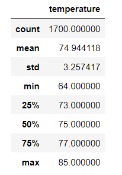
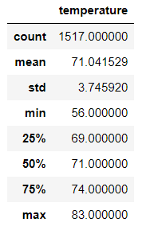

# surfs_up
# Overview of the analysis:
W. Avy wants more information about temperature trends before opening the surf shop in Oahu. Specifically, he wants temperature data for the months of June and December in Oahu, in order to determine if the surf and ice cream shop business is sustainable year-round.

# Results: 
- June has a higher mean temperature compared to December. June mean temperature is 74.94, December mean temperature 71.04. there is not a large difference in the mean temperatures.  
- June minimum temperature is 64, December min temperature is 56. This is a larger difference in the min temperature, but the minimum temperature even in December is above freezing. 
- Max temperature in June is 85, max temperature in December is 83. There is not a large difference in the max temperatures throughout the year. 

### June:

### December:

# Summary:
